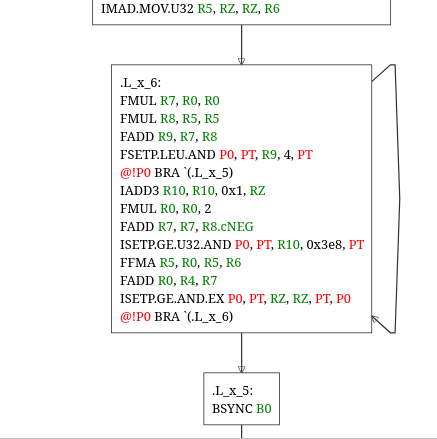

# Sass Graph Visualization tool

This projects creates HTML based visualizations for a given NVIDIA Sass binary.



## Example usage

*In a Jupyter notebook:*


```python
cfgs = sass_graph.generate_cfgs(sass_graph.disassemble("elf.o"))
sass_graph.display_cfg(cfgs["kernel_name"])
```

*Writing the output to a file*

```python
cfgs = sass_graph.generate_cfgs(sass_graph.disassemble("elf.o"))
cfgs["kernel_name"].dump("output.html")
```
